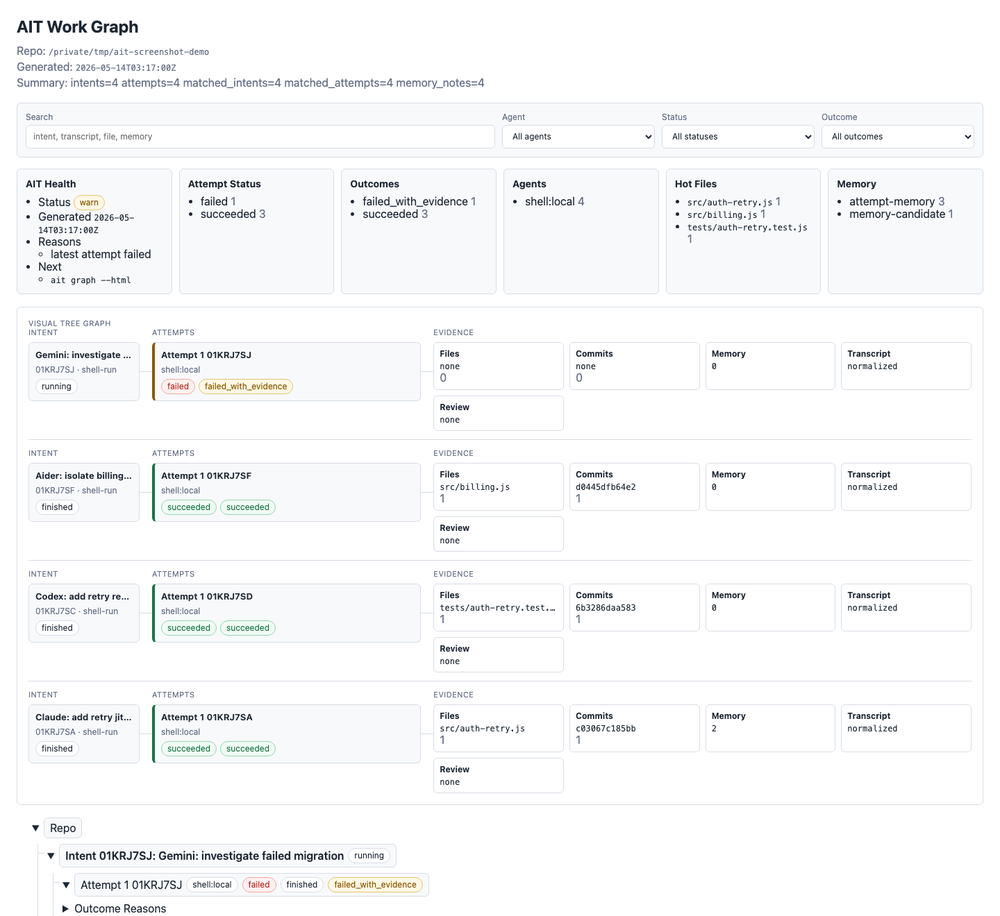

<div align="center">

# ait

### **Local control plane for multi-agent AI coding**
**Run Claude Code · Codex CLI · Aider · Gemini CLI · Cursor as a team on the same task — context handoff, review gate, attempt ledger — all on your machine.**

<sub>[English](README.md) · [繁體中文](README.zh-TW.md)</sub>

[](https://pypi.org/project/ait-vcs/)
[](https://www.npmjs.com/package/ait-vcs)
[](pyproject.toml)
[](LICENSE)
[](https://github.com/m24927605/ait/stargazers)
[](https://pypi.org/project/ait-vcs/)
[](https://github.com/m24927605/ait/commits/main)

</div>

---

<p align="center">
  
</p>
<p align="center"><sub>Real local CLI panel capture · Claude Code, Codex, and Aider responses recorded with context refs, command refs, and redacted transcripts</sub></p>

## Why ait exists

Single-agent AI coding tools — Claude Code, Cursor, Aider — are fast but lock
you to one model's view of the codebase. If that model misses something,
nothing catches it before the code hits your tree.

`ait` runs multiple agents as a team. One investigates, another implements, a
third reviews — and the review gate can **block the apply** if it finds a
critical issue. Cross-agent context is handed off via `AIT_CONTEXT_FILE`, not
re-pasted. Everything runs locally; your prompts, diffs, and provenance never
leave your machine.

It wraps the agent CLIs you already use. MIT, Python 3.14+, zero runtime
dependencies, no SaaS, no telemetry.

→ **Read the manifesto:** [Multi-agent AI coding belongs on your laptop](docs/marketing/manifesto-multi-agent-local.md)

## Install and try

```bash
pipx install ait-vcs            # or: npm install -g ait-vcs
cd your-repo
ait init                        # one-time per repo
direnv allow                    # only if prompted
claude ...                      # or codex / aider / gemini / cursor — ait wraps them
ait status                      # see what ran
ait apply latest                # apply when you are ready
```

The package is `ait-vcs` on PyPI and npm. The installed command is `ait`.

<p align="center">
  
</p>

<p align="center"><sub>Static HTML from <code>ait graph --html</code>: attempts, evidence, memory, hot files, and query filters in one local report.</sub></p>

## Key Capabilities

| Capability | What it means |
| --- | --- |
| Git-native attempt ledger | Each agent run becomes a queryable attempt linked to intent, prompt, context, output, files, commits, memory, and review evidence. |
| Live federated memory | Claude Code, Codex, Aider, Gemini, Cursor, and shell agents can read the same live repo memory: AIT-owned history plus current `CLAUDE.md`, `AGENTS.md`, `.claude/`, `.codex/`, and Cursor rules. |
| Long-term repo memory | Useful attempts, commits, notes, accepted facts, prior findings, and explicit adopted memory can survive across terminals, sessions, and weeks. |
| Agent-to-agent communication | One agent can record an investigation, decision, failed path, or review finding, and another agent can receive that context later through `AIT_CONTEXT_FILE` rather than hidden chat state. |
| Adversarial review | A separate reviewer agent can challenge an attempt; high-risk findings can be recorded and used to hold apply. |
| Attempt-first workflow | AIT wraps the agent CLIs you already use and turns each run into an isolated attempt before anything touches your root checkout. |
| Attempt provenance | Prompt, intent, adapter, output, changed files, commits, trace references, status, and outcome stay linked in one attempt record. |
| Worktree isolation | Every run gets an internal isolated Git worktree, so failed or risky attempts do not pollute your current workspace. |
| Parallel agent attempts | Multiple agents can try different approaches at the same time without racing inside the same checkout. |
| Explicit apply/recover flow | Agent output remains a proposal until you apply it; held or failed work remains recoverable instead of becoming working-copy debris. |
| Wrapper bypass detection | `ait status <adapter>` shows whether this shell will enter AIT or silently call the real agent binary. |
| Local-first metadata | AIT metadata lives under `.ait/` next to `.git/`; no SaaS dashboard, no telemetry, no required code upload. |
| Queryable history | Attempts, intents, files, agents, statuses, review results, and old prompts can be found with AIT commands instead of shell history. |

## Problems ait Solves

| Problem with agent coding today | What ait adds | Runnable example |
| --- | --- | --- |
| A bad prompt rewrites half your repo before you notice | Each run lands in an isolated Git worktree — your root checkout never moves | [`01-blast-radius`](examples/pain-point-demos/01-blast-radius/) |
| The diff has no useful provenance — which prompt produced it? | Attempts link intent, command output, files, and commits in one record | [`02-provenance`](examples/pain-point-demos/02-provenance/) |
| Failed or partial runs leave your working copy half-broken | Bad attempts stay recoverable; `ait recover latest` shows what AIT kept | [`03-failed-run-isolation`](examples/pain-point-demos/03-failed-run-isolation/) |
| The next agent repeats investigation you already paid tokens for | Shared repo-local memory feeds prior attempts, commits, notes, and accepted facts to the next run | [`04-memory-reuse`](examples/pain-point-demos/04-memory-reuse/) |
| Two agents on the same task stomp each other | Each attempt has its own worktree — run N agents in parallel | [`05-parallel-agents`](examples/pain-point-demos/05-parallel-agents/) |
| Did the agent really fix it, or just claim it did? | Explicit `ait apply latest` keeps speculative changes out of main until you decide | [`06-explicit-promotion`](examples/pain-point-demos/06-explicit-promotion/) |
| Cross-agent hand-offs lose every previous decision | Live repo memory combines current agent memory files with prior attempts, notes, and accepted decisions | [`07-cross-agent-handoff`](examples/pain-point-demos/07-cross-agent-handoff/) |
| Provenance tooling wants to ship your code to a SaaS | Metadata stays in `.ait/` next to `.git/` — harness daemon is local-only (Unix socket, no network), no telemetry | [`08-local-only-provenance`](examples/pain-point-demos/08-local-only-provenance/) |
| The same agent that wrote the code rubber-stamps its own work | Run adversarial review with another reviewer agent; high-risk findings can block apply | [`09-verification-evidence`](examples/pain-point-demos/09-verification-evidence/), [`09-1-codex-reviewer`](examples/pain-point-demos/09-1-codex-reviewer/) |
| "Where's that prompt I wrote last month?" -> grep shell history | Query attempts, intents, and commits with a structured DSL | [`10-prompt-search`](examples/pain-point-demos/10-prompt-search/) |

`ait` is not another agent. It is the local attempt workflow around the
agents you already trust.

## Core Concept

AIT does not replace Claude Code, Codex, or any other coding agent. It gives
them an attempt-first workflow. Every agent run becomes an attempt with its own
isolated worktree, provenance, queryable metadata, and explicit apply/recover
flow.

That keeps AI-generated changes in a reviewable proposal state. You can compare
attempts from different agents, inspect what each changed, keep failed runs for
recovery, and decide which result should land in your checkout.

Memory in AIT is **attempt-derived, evidence-backed repo memory**, not a hidden
chat-window transcript. It is not an external vector database product, not a
`CLAUDE.md` generator, and not a bag of unreviewed prompt snippets. AIT recalls
policy-allowed context from prior attempts, commits, notes, accepted facts, and
review findings, then federates that AIT-owned memory with live external
sources such as `CLAUDE.md`, `AGENTS.md`, `.claude/memory.md`,
`.codex/memory.md`, and `.cursor/rules` at recall/run/review time. Those files
remain their own source of truth; AIT does not auto-import them.

## Agent-to-agent communication

AIT gives agents a shared, local handoff channel that is tied to Git state:

1. A wrapped agent run creates an attempt with prompt, output, changed files,
   commits, status, and memory candidates.
2. Useful facts, decisions, failures, and review findings stay queryable under
   `.ait/` or in live repo memory files.
3. The next wrapped run receives `AIT_CONTEXT_FILE`, a compact handoff assembled
   from policy-allowed prior attempts, accepted facts, notes, commits, and live
   agent memory files.

That makes communication asynchronous and inspectable. Claude can investigate,
Codex can implement, Aider can patch, Cursor can follow repo rules, and a
reviewer agent can challenge the result without depending on one model's
private chat history.

## What It Feels Like

Initialize once:

```bash
ait init
direnv allow   # only if prompted
```

Confirm the current shell is actually routed through AIT:

```bash
ait status claude-code
ait status codex
ait status --all
```

`Bypass detection: wrapped` means the agent command resolves to the repo-local
AIT wrapper. `Bypass detection: bypass_risk` means this shell would call the
real agent binary directly, so AIT would not capture prompt, attempt, or
failure evidence. Re-run shell activation, `direnv allow`, or `ait repair`,
then check status again.

Then keep using your agent:

```bash
claude ...
codex ...
aider ...
gemini ...
cursor ...
```

After a successful wrapped run, inspect the result:

```bash
ait status
ait recover latest --debug   # optional low-level details
```

Apply only when you are ready:

```bash
ait apply latest
```

Until apply, your root checkout stays unchanged. If apply is unsafe
because your local edits overlap with the result, AIT holds the result
for recovery instead of stashing or overwriting your work.

Inspect cleanup candidates before reclaiming old internal workspaces:

```bash
ait cleanup
ait cleanup --apply
```

`ait cleanup` defaults to a dry run. Apply mode removes safe terminal
workspaces such as applied or discarded attempts while retaining active,
pending, and reviewable attempts by default.

## Core Features

| Feature | Description |
| --- | --- |
| Worktree isolation | Agent edits happen away from your root checkout; worktrees are an internal detail |
| Attempt provenance | Commands, status, output, changed files, and commits stay linked |
| Agent wrappers | Repo-local `claude`, `codex`, `aider`, `gemini`, and `cursor` wrappers |
| Auto commit capture | Successful changes become attempt-linked commits, without duplicating existing commits |
| Cleanup dry-run | Inspect and reclaim safe terminal attempt workspaces without touching reviewable work |
| Shared memory | Claude Code, Codex, and other agents can reuse the same live repo-local context |
| Long-term memory | Prior attempts, commits, notes, accepted facts, findings, and explicit adopted memory survive across sessions |
| Adversarial review | Ask a separate reviewer agent to challenge an attempt and persist blocking findings |
| Review flow | Apply, recover, inspect, and query attempts without managing worktrees by hand |

## Quick Examples

Set explicit intent and commit text:

```bash
AIT_INTENT="Update README" \
AIT_COMMIT_MESSAGE="update README with Claude" \
claude -p --permission-mode bypassPermissions \
  "Shorten the README and improve the quickstart"
```

Wrap a command directly:

```bash
ait run --adapter claude-code --intent "Refactor query parser" -- claude
ait run --adapter codex --intent "Implement parser edge cases" -- codex
ait run --adapter aider --intent "Fix auth expiry" -- aider src/auth.py
ait run --adapter shell --intent "Regenerate fixtures" -- \
  python scripts/regenerate_fixtures.py
```

Use repo-local memory:

```bash
ait memory
ait memory sources
ait memory search "auth adapter"
ait memory recall "billing retry"
ait memory backfill --dry-run
ait memory backfill --import
```

`ait memory sources` and default `ait memory recall` are zero-touch reads:
they do not create `.ait/`, do not mutate source files, and read current
repo-local agent memory live. `ait memory backfill --dry-run` is also
zero-write preview. Use `backfill --import` only as an explicit mutation when
you want AIT to add advisory memory under `.ait/`; it is not required for live
recall. Global or out-of-repo memory requires an explicit `--global --path ...`.

Run adversarial review before apply:

```bash
ait review attempt latest-reviewable \
  --mode adversarial \
  --review-adapter claude-code \
  --review-budget standard

ait review finding list --severity high --format text
ait review report --attempt latest --format json
ait apply latest --mode current
```

Repair local setup if wrappers drift:

```bash
ait repair
ait repair codex
```

## Integrations

`ait` ships first-class adapters for the agents most teams already run.
Each adapter wraps the upstream CLI, isolates its work in a Git worktree,
and records the attempt locally in `.ait/`.

`ait init` detects every supported agent CLI on `$PATH` and wires it up
automatically — wrappers under `.ait/bin/`, hooks merged into the
relevant `.claude/`, `.codex/`, `.gemini/` config. The per-adapter
sections below assume you already ran `ait init`. To re-run setup
explicitly (e.g. after upgrading an agent), use `ait adapter setup
<name>`.

### Run Claude Code safely

```bash
claude -p --permission-mode bypassPermissions "Refactor the auth module"
```

`ait` captures the prompt, edited files, status, and resulting commits as
one attempt. Apply it with `ait apply latest` once you are happy with the
result, or use `ait run --apply auto ...` when you want safe results
applied immediately.

### Run Codex CLI safely on a real repository

```bash
ait run --adapter codex --intent "Implement parser edge cases" -- codex
```

Each Codex session edits in isolation. Failed attempts are kept for
recovery; only applied attempts touch your root checkout.

### Run Aider in isolation

```bash
ait run --adapter aider --intent "Fix auth expiry" -- aider src/auth.py
```

Aider's commits are captured as attempt results, with full provenance
linking the prompt, edited files, and commits.

### Run Gemini CLI with attempt history

```bash
ait run --adapter gemini --intent "Add config validation" -- gemini
```

Gemini sessions are recorded as attempts the same way as Claude Code and
Codex. `ait memory recall` later surfaces what each agent tried.

### Run Cursor agents with reviewable provenance

```bash
ait run --adapter cursor --intent "Migrate to new SDK" -- cursor
```

Cursor edits are confined until you apply them. The attempt log keeps
the changed files, exit status, and commits available for review and
recovery.

### Wrap any other shell agent

```bash
ait run --adapter shell --intent "Regenerate fixtures" -- \
  python scripts/regenerate_fixtures.py
```

Use the generic `shell` adapter to give attempt provenance to any custom
agent or script.

## Compared to alternatives

`ait` is the layer **around** the agents, not a replacement.

| You already use | `ait` adds |
| --- | --- |
| **Naked `git worktree` + manual cleanup** | Auto-managed internal workspaces, attempt records, `apply`/`recover` verbs, queryable history — see [ait vs naked git-worktree](https://m24927605.github.io/ait/compare/git-worktree-naked-vs-ait/) |
| **Aider's `--auto-commits`** | Outer-layer attempt history (Aider commits land *inside* an `ait` attempt), cross-session memory, multi-agent handoff |
| **Claude Code's built-in worktrees** | Cross-agent (not Claude-only), structured attempt records, query DSL, explicit `apply`/`recover` |
| **SaaS observability (Langfuse, Braintrust)** | Local-first, no telemetry, `git`-native (commit-linked, not token-linked); they operate at the LLM-call layer, `ait` at the git-call layer — both stack |
| **GUI-first agent managers, memory layers, review bots** | AIT is CLI-first today. It is strongest as a local attempt ledger around existing CLIs: memory, review, provenance, and apply/recover are one Git-native workflow. See the [category comparison](https://m24927605.github.io/ait/compare/agent-managers-memory-review-vs-ait/). |

## How It Works

```text
your prompt
    |
    v
agent CLI wrapped by ait
    |
    v
internal isolated workspace
    |
    v
attempt metadata + commits + memory
    |
    v
review, apply, recover, or inspect
```

The wrapped process receives:

```text
AIT_INTENT_ID
AIT_ATTEMPT_ID
AIT_WORKSPACE_REF
AIT_CONTEXT_FILE   # when context is enabled
```

`AIT_CONTEXT_FILE` contains a compact repo-local handoff selected from
previous attempts, commits, curated notes, accepted facts, review findings, and
live external memory files such as `CLAUDE.md`, `AGENTS.md`,
`.claude/memory.md`, `.codex/memory.md`, and `.cursor/rules`. AIT records a
versioned `ait.context_manifest` next to the context file. The manifest
separates trusted baseline, advisory, and excluded memory; candidate, stale,
superseded, and policy-blocked memory cannot become trusted baseline, and
policy-blocked body text is not copied into the context or manifest.

## Install

Recommended:

```bash
pipx install ait-vcs
ait --version
```

Virtual environment:

```bash
python3.14 -m venv .venv
.venv/bin/pip install ait-vcs
.venv/bin/ait --help
```

npm wrapper:

```bash
npm install -g ait-vcs
ait --version
```

Tagged GitHub release:

```bash
pipx install "git+https://github.com/m24927605/ait.git@v0.55.67"
```

Upgrade:

```bash
ait upgrade
ait --version
```

Preview an upgrade:

```bash
ait upgrade --dry-run
```

## Useful Commands

```bash
ait status
ait status claude-code
ait status codex
ait status --all
ait doctor
ait doctor --fix

ait adapter list
ait adapter doctor claude-code
ait adapter setup claude-code

ait attempt list
ait attempt show <attempt-id>
ait resume latest
ait intent show <intent-id>
ait context <intent-id>

ait memory
ait memory sources
ait memory search "auth adapter"
ait memory recall "billing retry"
ait memory backfill --dry-run
ait memory backfill --import
ait memory lint
ait memory lint --fix

ait graph
ait graph --html
ait console --read-only
ait console action apply --attempt latest --dry-run --format json

ait policy validate --format json
ait metadata export --dry-run --output ait-metadata.bundle.json --format json
ait metadata import --input ait-metadata.bundle.json --dry-run --format json
```

Shell auto-activation:

```bash
ait shell show --shell zsh
ait shell install --shell zsh
ait shell uninstall --shell zsh
```

## Requirements

- Python 3.14+
- Git
- SQLite from the Python standard library
- Node.js 18+ only when installing through npm

## Status

`ait` is currently `0.55.67` and alpha quality. It is intended for local
dogfooding, power users, and infra-minded engineers who are comfortable with
Git workflows.

Metadata is local to one repository under `.ait/`. It is not
synchronized across machines.

The visual model is becoming usable: `ait graph --html` remains a static local
report, and `ait console --read-only` writes or serves a loopback-only daily
console over the same attempt graph, evidence, memory, hot files, and review
results. Browser mutation UI is not enabled. A CLI action dry-run layer now
exists for apply/recover/discard preflight and append-only journaling, but real
apply/recover/discard still go through the existing CLI/domain paths.

Team-readiness hardening is still local-first: `.ait/policy.json` validation is
fail-closed and is now consumed by apply, review, console action preflight, and
context trust filtering. Metadata export/import currently supports dry-run
planning only. There is still no cross-machine sync, SaaS dashboard, telemetry,
automatic push, or automatic merge.

Product direction:

| Current constraint | Solution path |
| --- | --- |
| Category can sound like several tools at once | Anchor the product as a local control plane and Git-native attempt ledger; describe memory, review, provenance, and apply/recover as parts of that ledger. |
| CLI-first experience loses some users to visual agent managers | Keep the daily console read-only while hardening apply/recover/discard dry-run preflight and journaling before any browser mutation UI. |
| Alpha quality limits broad team adoption | Focus first on local power users and infra-minded engineers; expose dry-run metadata export/import and fail-closed policy validation before any broader team sync story. |
| "Memory" can be mistaken for prompt stuffing | Keep memory attempt-derived, evidence-backed, inspectable, and tied to Git state; avoid claiming external vector DB or hidden chat memory behavior. |
| Review gate impact needs proof | The 10-case benchmark fixture and repaired Claude/Codex dogfood artifacts now exist. Keep publishing honest repeated runs until recall, false positives, latency, token cost, and the deterministic-vs-LLM tradeoff are stable enough for a quality claim. |

## Development

Set up the repository:

```bash
python3.14 -m venv .venv
.venv/bin/pip install -e .
.venv/bin/pip install pytest
```

Verify:

```bash
.venv/bin/pytest -q
.venv/bin/ait --version
.venv/bin/ait --help
```

Before a release:

```bash
git status --short
.venv/bin/pytest -q
```

The release version in `pyproject.toml`, the Git tag, and this README
should match.

## Documentation

- [Documentation site](https://m24927605.github.io/ait/) — full docs in English and 繁體中文
- [Why ait](https://m24927605.github.io/ait/why-ait/) — the ten problems ait solves
- [Getting started](https://m24927605.github.io/ait/getting-started/)
- [AI search facts (Q&A)](https://m24927605.github.io/ait/facts/)
- [Compare: naked git-worktree vs ait](https://m24927605.github.io/ait/compare/git-worktree-naked-vs-ait/)
- [Compare: agent managers, memory layers, review bots](https://m24927605.github.io/ait/compare/agent-managers-memory-review-vs-ait/)
- [Command reference](https://m24927605.github.io/ait/reference/commands/)
- [Adversarial code review](https://m24927605.github.io/ait/reference/adversarial-code-review/)
- [SEO strategy (internal)](docs/seo-strategy.md)

For internal design notes (specs, memory architecture, refactor plans),
see [`docs/`](docs/), including the [product weakness response plan](docs/ait-product-weakness-response-plan-zh.md).
